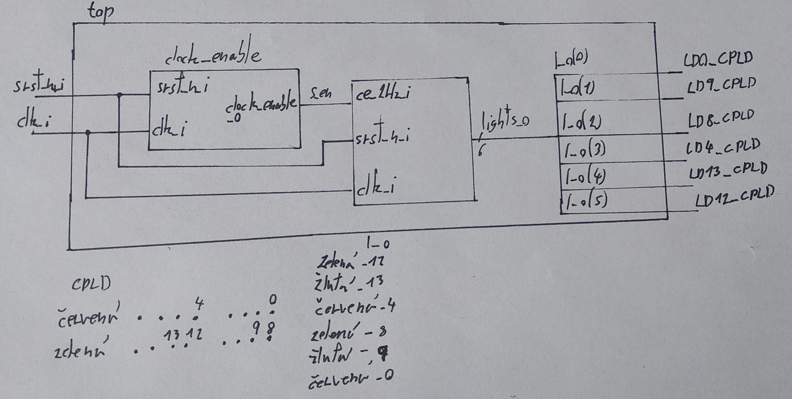

Traffic Lights

top:



traffic_light_controller
```
library ieee
use ieee.std_logic_1164.all;
use ieee.numeric_std.all;

entity traffic_light_controller is
port (
	clk_i 	: in std_logic;  --10 kHz clock
	srst_n_i : in std_logic; --reset
	ce_2HZ_i : in std_logic; --2 Hz for the counter
	
	lights_o : out std_logic_vector (6-1 downto 0); -- LED output 
	count_o 	: out std_logic_vector (4-1 downto 0) --for tb01 
);
	
end  entity traffic_light_controller;

architecture Behavioral of traffic_light_controller is
	type state_type is 		(c_c0, c_ze, c_zl, c_c1, ze_c, zl_c);
--		s0	 	s1	   	s2		s3			s4			s5
-- s0 c_c0 in case of reset 
	signal s_state: state_type;
	signal s_count: unsigned (4-1 downto 0);
	constant c_5sec : unsigned (4-1 downto 0) := "1001";  -- 9 (dec) (0 to 9)
	constant c_1sec : unsigned (4-1 downto 0) := "0001";  -- 1 (dec) (0 to 1)

begin
	p_change_state : process(clk_i)
	begin
		if rising_edge(clk_i) then
			if srst_n_i = '0' then  --reset
				s_state <= rd_rd0;  -- state 0 
				s_count <= (others => '0');
			
			elsif ce_2Hz_i = '1' then
				case s_state is
					when c_c0 =>   					--s0
						if s_count < c_1sec then		--wait 1s
							s_state <= c_c0; 		--s0
							s_count <= s_count + 1;
						else
							s_state <= c_ze; 		--s1
							s_count <= (others => '0'); 	--set to 0
						end if;
						
					when c_ze =>					--s1
						if s_count < c_5sec then		--wait 5s
							s_state <= c_ze; 		--s1
							s_count <= s_count + 1;
						else
							s_state <= c_zl; 		--s2
							s_count <= (others => '0'); 	--set to 0
						end if; 
							
					when c_zl =>					--s2
						if s_count < c_1sec then		--wait 1s
							s_state <= c_zl; 		--s2
							s_count <= s_count + 1;
						else
							s_state <= c_c1; 		--s3
							s_count <= (others => '0'); 	--set to 0
						end if; 
						
					when c_c1 =>					--s3
						if s_count < c_1sec then		--wait 1s
							s_state <= c_c1; 		--s3
							s_count <= s_count + 1;
						else
							s_state <= ze_c; 		-- s4
							s_count <= (others => '0'); 	--set to 0
						end if; 
						
					when ze_c =>					--s4
						if s_count < c_5sec then		--wait 5s
							s_state <= ze_c; 		--s4
							s_count <= s_count + 1;
						else
							s_state <= zl_c; 		--s5
							s_count <= (others => '0'); 	--set to 0
						end if; 
						
					when zl_c =>					--s5
						if s_count < c_1sec then		--wait 1s
							s_state <= zl_c; 		--s5
							s_count <= s_count + 1;
						else
							s_state <= c_c0; 		--s0
							s_count <= (others => '0'); 	--set to 0
						end if; 
						
					when others =>
							s_state <= c_c0; 		--s0
							
				end case;
			end if;
		end if;
	end process;
	
	--states: c_c0, c_ze, c_zl, c_c1, ze_c, zl_c
	-- lights_o : "Zelena Zluta Cervena Zelena Zluta Cervena"
	p_out : process(s_state)
		begin
		case s_state is
			when c_c0 => lights_o <= "001001"; 
			when c_ze => lights_o <= "001100"; 
			when c_zl => lights_o <= "001010"; 
			when c_c1 => lights_o <= "001001"; 
			when ze_c => lights_o <= "100001"; 
			when zl_c => lights_o <= "010001"; 
			when others => lights_o <= "001001";
		end case;
	end process;
	
	count_o <= std_logic_vector(s_count); -- tb01
	
end architecture Behavioral;
--Fiala Marek
```


Reset:


