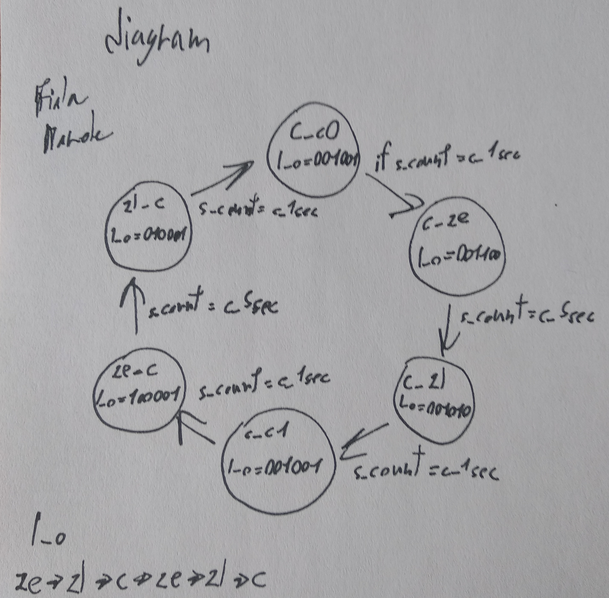

Traffic Lights

top:


traffic_lights_controller
```vhdl
library ieee;
use ieee.std_logic_1164.all;
--use ieee.std_logic_unsigned.all;
use ieee.numeric_std.all;

...

architecture traffic of traffic is
    ...
    --signal count: std_logic_vector(3 downto 0);
    --constant SEC5: std_logic_vector(3 downto 0) := "1111";
    --constant SEC1: std_logic_vector(3 downto 0) := "0011";
    signal count : unsigned(3 downto 0);
    constant SEC5: unsigned(3 downto 0) := "1111";
    constant SEC1: unsigned(3 downto 0) := "0011";

    ...

        --elsif clk'event and clk = '1' then
        elsif rising_edge(clk) then
        ...

end traffic;
```


Reset:



