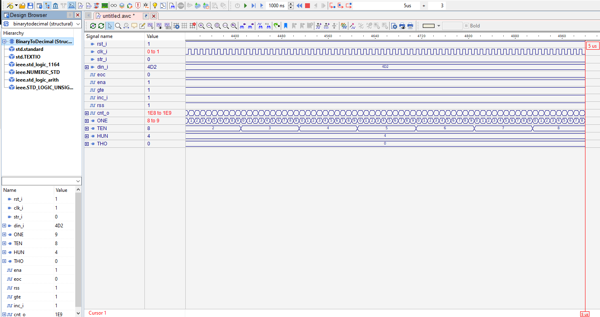

# Ultrazvukový měřič vzdálenosti HC-SR04

Podstatou tohoto projektu je samostatně nastudovat zadanou problematiku, navrhnout koncepci vlastního řešení a tu simulovat, případně implementovat.

Z datasheetu HC_SR04 jsme zjistili snímací rozsah 2-400cm s 3mm přesností.

Pro měření vzdálenosti potřebujeme vědět rychlost signálu a uběhnutý čas. Echo back je čas, indikující trvání příjmutí signálu od vysílání.

Schéma modulu HC_SR04:

Vnitřní zapojení modulu **HC_SR04**:

Když je **Latch** outputu  signál "1", označený „ena“ (který slouží i jako trigger modelu) aktivuje **Timer** 10us. Pro změření délky signálu využijeme Timer, kdykoliv je echo_o "1", **Timer** bude produkovat signál každou 1 μs.
**Counter** závisí na maximální délce měření. Maximální délka modulu je 4 metry což je 8 metrů obousměrně. Z toho vypočteme:

Rychlost zvuku ve vzduchu za pokojové teploty je přibližně 340 m/s.
Maximální čas signálu pro 4 metrový rozsah je :  
**tmax**=  (8 m (bereme v potaz oba směry))/340= 0,023529 s = **23529 μs** (to by jsme potřebovali 15 bit counter)

Výstup **Counteru** je čas a ne vzdálenost,  proto potřebujeme výstup vynásobit rychlostí zvuku:
Pracujeme v "μs" proto převedeme rychlost na patřičné hodnoty:                                  
**rychlost zvuku** = (mm/μs) = 340 m/s * 1000mm/1m *1s/1000000μs = 0,34 mm/μs (oba směry) --> **0,17mm/μs** (jeden směr)

Abychom mohli binarní číslo z **Counter** vynásobit decimálním číslem, musíme číslo převést na binární číslo.

Dále pro převedení desetinného čísla na fixní fomát potřebujeme zvolit bitové číslo pro celé číslo a pro zlomek.
Protože **0.17** je menší jak 1, můžeme použít zlomkovou část viz.

Pro zlomkovou část máme formát **F0.16**.                       
Na druhou stranu zčítaný čas z **Counter** je ve tvaru celého čísla, takže je ve formátu **F15.0**.  
Proto součin **F15.0 * F0.16** nám dává pevný bod formátu **F15.16**.   
Pro převedení  **0.17** na formát **F0.16**, vynásobíme číslem 2^16 = **11141.12** to převedeme na binární číslo se 16 bity, což je **0010 1011 1000 0101**.                      
K zobrazení vzdálenosti čtyř metrů nám stačí 12 bitů viz:                             

Vytvořili jsme program **DistanceMeter** a jemu příslušné **Latch, Timer, Counter**.          
Dále provedeme simulaci funkčnosti **DistanceMeter**:

**Nastavíme:**                                                    
	rst_i (reset) na 0 ->0ns, 1 ->10ns                  
	clk (clock) na signál o frekvenci 100Mhz                                                     
	str (start) na 0 ->0ns, 1 ->100ns, 0 ->110ns                                                     

Po uspěšném zprovoznění se můžeme pustit na další část. 

### Dále se pokusíme dostat signál do finální podoby ve formě zobrazení hodnoty na 7 segmentovém displeji.
Jako nejjednodušší řešení jsme vymysleli zařazení **DecimalCounteru**  na výstup **dis_o** a vytvořili převod **BinarToDecimal**.

Vnitřní zapojení **DecimalCounter**:

Modul **BinarToDecimal**:

Vnitřní zapojení **BinarToDecimal**:

Začínáme pulzem v str_i, výstup z **Latch** je pojmenován jako **ena**. Counter je nastaven na "1". Výstup **Counteru** je porovnán s **din_i** (data input), pokud je **din_i** větší nebo stejný jako **cnt_o**, výstup bude "1", takže na **inc_i** (vstup do **DecimalCounter**) bude "1". Poté co **cnt_o** překoná **din_i**,  bude na výstupu "0". Problém aby **cnt_o** nebyl znovu "0", jsme přiřadili **ena** do hradla AND se signálem **gte**. Takže na výstupu bude "1", pokud na obou vstupech bude "1". Aby se nám na výstupu **DecimalCounter** nezvyšovala hodnota z předchozých hodnot, tak jsme zavedli **rst_i** (reset) společně s negovaným signálem startu do AND pro resetování **DecimalCounter** pokaždé, když začne nový proces.

Nyní provedeme simulaci:

Simulací jsme ověřili funkčnost našeho čítače.

Následně upravíme **DistanceMeter**:
viz modul:

Ale není tu signál, který indikuje, kdy měřící proces zmizel a také, kdy začít konvertovat. Měřící proces končí když **Echo signál** klesá k "0". Takže potřebujeme detekovat, kdy signál klesne. Proto jsme vytvořili **FallingEdge** detektor. 

Zobrazení funkce detektoru:
 
 
 
Zde vidíme modul **FallingEdge**:

 Vnitřní zapojení: (pro zvýšení přesnosti jsme zapojili více **Flip_flop** za sebou)
 
  

Následně přidáme náš **FallingEdge** do schéma modulu **DistanceMeter**:

  

Dále potřebujeme přidat výstup pro sedmisegmentovku a anod. display.                     
Poté jsme vyzkoušeli funkčnost v simulaci:

**Nastavení**                                   
rst_i, clk_i je stejné jako v předchozích simulací                                  
ech_i (echo signál) přiřadíme k tlačítku na klávesnici třeba S, přes které ovládáme signál viz schéma.

  
  
  
Simulací jsme potvrdili funkčnost našeho programu, pro účel použití měření vzdálenosti.
Cílem tohoto projektu bylo naprogramovat ultrazvukový měřič vzdálenosti HC-SR04, který principálně slouží jako vysílač / příjmač vyslaného signálu a dále převod tohoto signál na výstup v podobě zobrazení na sedmisegmentovcém displeji.

### Legenda:

## Zdroje
[web page](https://www.xilinx.com/products/design-tools/ise-design-suite/ise-webpack.html)

